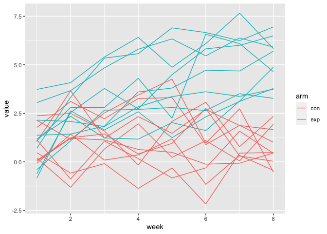
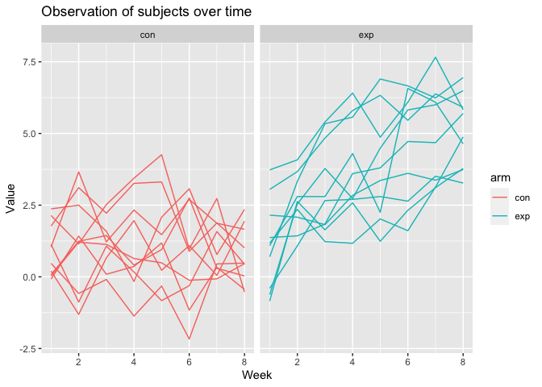
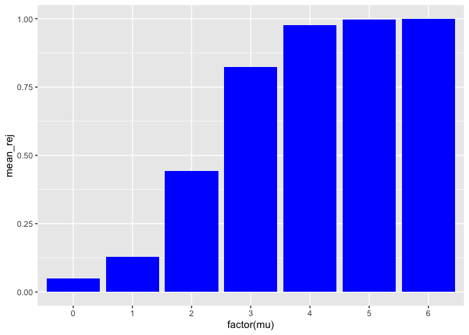
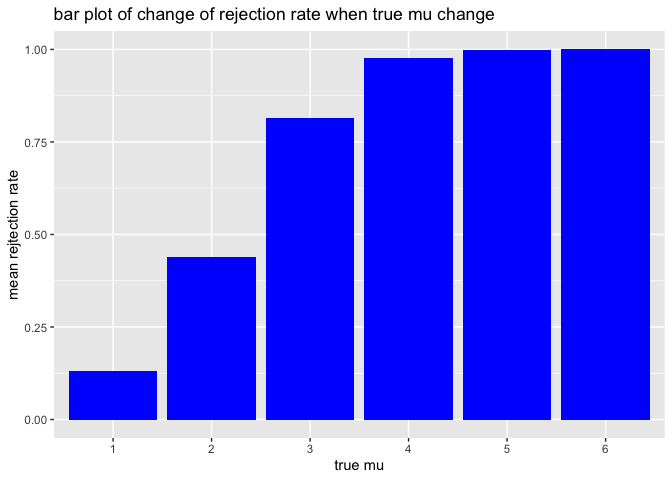
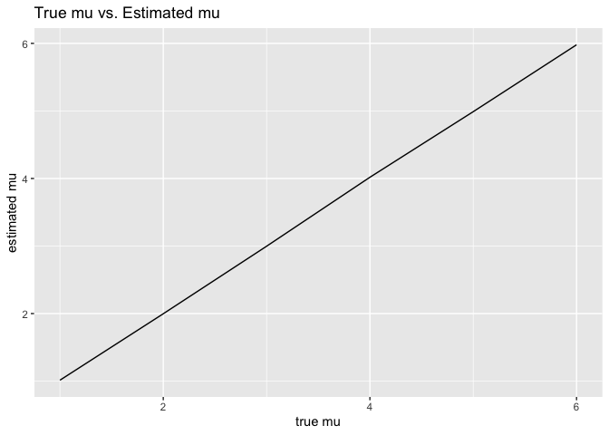

p8105_hw5_yd2739
================
Yuxuan Du
2023-11-05

``` r
library(tidyverse)
```

    ## ── Attaching core tidyverse packages ──────────────────────── tidyverse 2.0.0 ──
    ## ✔ dplyr     1.1.3     ✔ readr     2.1.4
    ## ✔ forcats   1.0.0     ✔ stringr   1.5.0
    ## ✔ ggplot2   3.4.3     ✔ tibble    3.2.1
    ## ✔ lubridate 1.9.2     ✔ tidyr     1.3.0
    ## ✔ purrr     1.0.2     
    ## ── Conflicts ────────────────────────────────────────── tidyverse_conflicts() ──
    ## ✖ dplyr::filter() masks stats::filter()
    ## ✖ dplyr::lag()    masks stats::lag()
    ## ℹ Use the conflicted package (<http://conflicted.r-lib.org/>) to force all conflicts to become errors

``` r
library(ggplot2)
```

## Problem 1

``` r
homicides_data = read_csv('https://raw.githubusercontent.com/washingtonpost/data-homicides/master/homicide-data.csv')
```

    ## Rows: 52179 Columns: 12
    ## ── Column specification ────────────────────────────────────────────────────────
    ## Delimiter: ","
    ## chr (9): uid, victim_last, victim_first, victim_race, victim_age, victim_sex...
    ## dbl (3): reported_date, lat, lon
    ## 
    ## ℹ Use `spec()` to retrieve the full column specification for this data.
    ## ℹ Specify the column types or set `show_col_types = FALSE` to quiet this message.

``` r
homicides_summary = homicides_data|>
  mutate(city_state = paste(city, state, sep = ", "))|>
  group_by(city_state)|>
  summarise(
    total_homicides = n(),
    unsolved_homicides = sum(disposition %in% c("Closed without arrest", "Open/No arrest"))
  )
```

``` r
baltimore_data = homicides_summary|>
  subset(city_state == "Baltimore, MD")

baltimore_prop_test = prop.test(pull(baltimore_data, unsolved_homicides), pull(baltimore_data, total_homicides))|>
  broom::tidy()

baltimore_est_prop = baltimore_prop_test|>
  pull(estimate)


baltimore_CI = baltimore_prop_test|>
  subset(select = c(conf.low, conf.high))
```

``` r
city_estimates = homicides_summary|>
  mutate(
    prop_test = map2(unsolved_homicides, total_homicides, ~prop.test(.x, .y)),
    tidy_test = map(prop_test, broom::tidy)
  )|>
  unnest(tidy_test)|>
  subset(select = c(city_state, estimate, conf.low, conf.high))
```

    ## Warning: There was 1 warning in `mutate()`.
    ## ℹ In argument: `prop_test = map2(unsolved_homicides, total_homicides,
    ##   ~prop.test(.x, .y))`.
    ## Caused by warning in `prop.test()`:
    ## ! Chi-squared approximation may be incorrect

``` r
ggplot(city_estimates, aes(x = reorder(city_state, estimate), y = estimate)) +
  geom_point() +
  geom_errorbar(aes(ymin = conf.low, ymax = conf.high), width = 0.2) +
  coord_flip() +
  labs(x = "City", y = "Proportion of Unsolved Homicides", title = "Proportion of Unsolved Homicides by City") +
  theme_minimal()
```

<!-- -->

## Problem 2

First, we use list.files to create list of file names, and use map to
iterate through the list and read all data into DF. Than we unnest the
DF and change format of ID and arm. After that, the DF was pivoted for
further analysis.

``` r
file_names = list.files(path = "data", pattern = "*.csv", full.names = TRUE)

file_info = data_frame(file_name = file_names)

file_info = file_info |>
  mutate(data = map(file_name, read_csv))|>
  unnest()|>
  mutate(ID = substring(file_name, 10, 11))|>
  mutate(arm = substring(file_name, 6, 8))|>
  subset(select = -c(file_name))|>
  relocate(arm, ID)

file_info_pivoted = file_info|>
  pivot_longer(cols = starts_with("week"), names_to = "week", values_to = "value")|>
  mutate(week = as.numeric(substring(week, 6,6)))
```

``` r
file_info_pivoted|>
  group_by(arm, ID)|>
  ggplot(aes(x = week, y = value, color = interaction(arm, ID)))+
  geom_line()
```

<!-- -->
This plot looks hard to interpret. So I decide to use facet grid to
separate different arm.

``` r
file_info_pivoted|>
  group_by(arm, ID)|>
  ggplot(aes(x = week, y = value, color = interaction(arm, ID)))+
  geom_line()+
  facet_grid(~arm)
```

<!-- -->

In this plot, we could see that the expirimental group have overall
increasing trend during the experiment period.

## Problem 3

``` r
set.seed(1234)
n = 30
sigma = 5
alpha = 0.05

dataset = data.frame(x = 1:10)

simulation = function(mu) {
  results = replicate(5000, {
    sample = rnorm(n, mean = mu, sd = sigma)
    test_result = t.test(sample, mu = 0)
    tidy_test_result = broom::tidy(test_result)
    c(estimate = pull(tidy_test_result, estimate), p.value = pull(tidy_test_result, p.value), mu)
  })
  t(results)
}

zero_sim_df = simulation(0)

sim_output = vector("list", length = 7)

for (i in 0:6){
  sim_output[[i+1]] = simulation(i)
}
```

``` r
sim_output_df = data.frame(do.call(rbind, sim_output))|>
  rename(mu = V3)|>
  mutate(reject = ifelse(p.value < 0.025 | p.value > 0.975, 1, 0))
 
sim_output_df|>
  group_by(mu)|>
  summarise(mean_rej = mean(reject))|>
  ggplot(aes(x = factor(mu), y = mean_rej))+
  geom_bar(stat = "identity", fill = "blue")
```

<!-- --> We
could see that as the mu increase, the rejection rate increase. So the
power increase as effect size increase.

``` r
sim_output_df|>
  group_by(mu)|>
  summarise(est_mu = mean(estimate.mean.of.x))|>
  ggplot(aes(x = mu, y = est_mu))+
  geom_line()
```

<!-- -->

``` r
sim_output_df|>
  subset(reject == 1)|>
  group_by(mu)|>
  summarise(est_mu = mean(estimate.mean.of.x))|>
  ggplot(aes(x = mu, y = est_mu))+
  geom_line()
```

<!-- -->
No, the two lines does not approximately equal. This is because the
group rejected H0 does not contains 0 in their 95% CI, while the group
failed to reject H0 will contains 0 in their 95% CI, this makes the the
group reject H0 have hight average mean.
